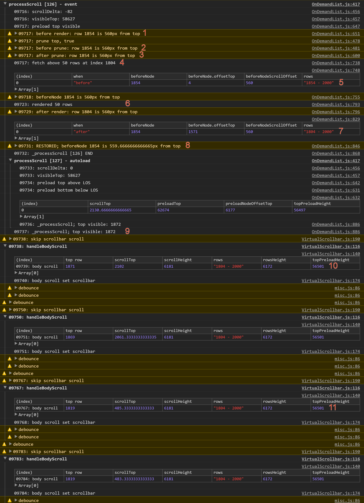

The `VirtualScrollbar` extension is close to being in working condition. There is only one outstanding bug I'm aware
of, but it is significant.

# Edit `test/VirtualScrollbar.html` and reduce the row count to something more manageable, like 5000.
# Load `test/VirtualScrollbar.html`.
# Use the scrollbar to scroll down about 50%.
# Use the mouse wheel within the grid content to scroll rows up. Keep gradually going up, paying close attention to
the number of rows scrolled. At some point there will be a jump (instead of scrolling up 2-5 rows, it scrolls up 50
rows).

Below is a screenshot of some debugger logging with numbers added at interesting points, and below that a description
of what's going on:

1. Scrolling has happened, we are in the `OnDemandList#_processScroll` method that is set
to handle scroll events. Row 1854 is the first rendered row, and it is 560px from the top.
2. We are about to prune rows, row 1854 has not moved.
3. We pruned rows, row 1854 still has not moved.
4. We fetched 50 rows and are going to render them.
5. Before rendering the fetched rows row 1854 still has not moved.
6. 50 new rows were rendered above the existing rows.
7. As expected, the new rows pushed down the existing rows, so now row 1804 has taken the
position of row 1854, and 1854 is down lower.
8. We adjust the scroll position to restore row 1854 to its previous position.
9. We are done with `_processScroll` and everything is great and wonderful!
10. The body scroll handler from `VirtualScrollbar.js` is executed, things still look fine (top visible row is 1871).
11. The body scroll handler from `VirtualScrollbar.js` is executed, but the rows have magically
jumped by 50 rows. I cannot figure out that any of our code is executing between 10 and 11 that would
have caused this, and the insertion of "new" DOM should not be causing it, as the new DOM (new rows)
were already inserted during `_processScroll` and correctly handled.